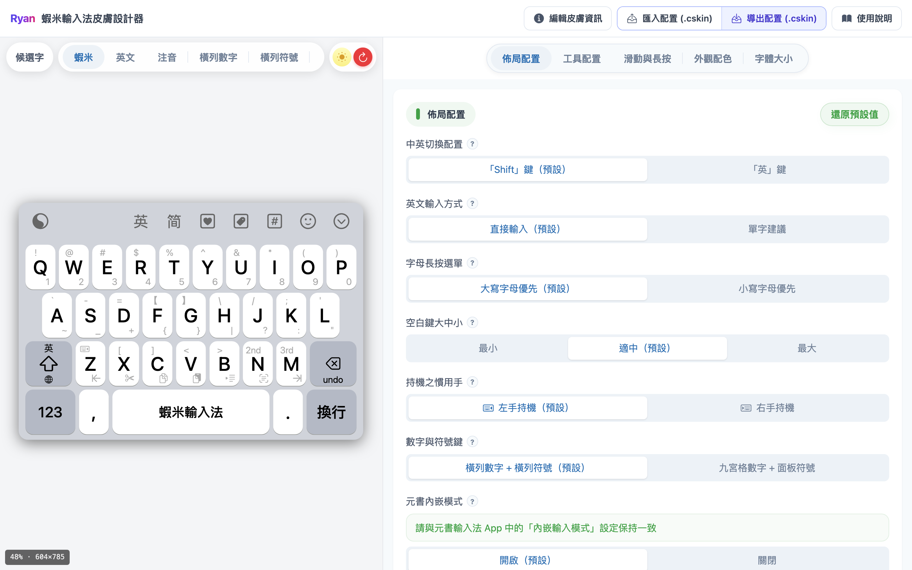

# 蝦米輸入法皮膚設計器

網頁工具，用來設計蝦米輸入法鍵盤皮膚：調整佈局、工具列、配色、字體，導出 `.cskin` 後裝進 [元書輸入法](https://ryanwuson.github.io/rime-liur-ios/)。

## 開啟設計器

**[蝦米輸入法皮膚設計器](https://ggininder.work/r/Ryan)**

> **關於網址與隱私**
>
> 上方連結為**轉址**，會帶你到 **Google Gemini Canvas** 上的皮膚設計器。首次開啟時，Google 可能要求**登入 Google 帳號**（Google 端要求，與元書輸入法 App 無關）。
>
> - 調整內容平常留在**你的瀏覽器**；僅按「導出配置」時在本機下載檔案。
> - **AI 靈感** 會將風格描述送交 Google Gemini 處理；請勿填入敏感個資。
> - 作者不會架設後台蒐集你的皮膚資料。

## 從這裡開始

| 情境 | 建議閱讀 |
|------|----------|
| 第一次使用 | [建議操作流程](workflow.md) |
| 要調顏色 | [套用範圍](apply-scope.md) → [外觀配色](settings/appearance.md) |
| 要改佈局、工具列 | [佈局配置](settings/layout.md) · [工具配置](settings/toolbar-config.md) |
| 已導出，要裝進手機 | [使用指南：皮膚安裝](https://ryanwuson.github.io/rime-liur-ios/#/skin/install-on-phone) |

## 相關連結

- [元書輸入法蝦米方案手冊](https://ryanwuson.github.io/rime-liur-ios/)（打字、手勢、輸入功能）
- [開啟設計器](https://ggininder.work/r/Ryan)
