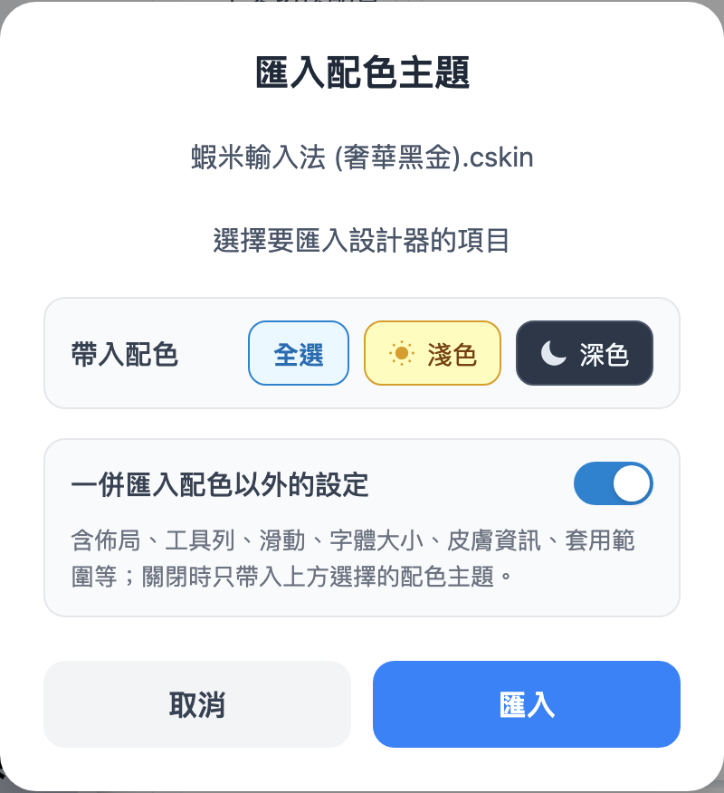

# 匯入與導出

## 導出

按「[導出配置](interface/top-bar.md)」→ 下載 `.cskin` → 到元書輸入法 App：

1. 長按鍵盤皮膚
2. 按 **「運行 main.jsonnet」**（最重要）
3. 可依需要查看 README、跳轉皮膚目錄

完整步驟見 [使用指南·手機安裝皮膚](https://ryanwuson.github.io/rime-liur-ios/#/skin/install-on-phone)。

## 建議保留 .cskin 檔

設計器調整平常只留在**瀏覽器**；關閉分頁或清除資料後，若無 `.cskin` 備份就**無法**再「匯入配置」接續編輯。

- 每次導出後請保留檔案（iCloud、電腦、雲端）
- 皮膚已裝進元書後，`.cskin` 仍可當「設計稿」保留

## 匯入

按「匯入配置」選 `.cskin` 後，會出現 **匯入配色主題** 視窗：

1. **帶入配色**（全選／淺色／深色）
2. **一併匯入配色以外的設定**（預設開啟）
3. 按「匯入」

| 選擇 | 配色 | AI 靈感 |
|------|------|---------|
| **全選** | 整包帶入 | 整包覆寫 |
| **只淺色或只深色** | 該邊來自檔案；另一邊保留編輯器 | 若**已用過** AI 靈感 → 保留現有；否則寫入檔案內 |

| 一併匯入配色以外的設定 | 效果 |
|------------------------|------|
| **開啟**（預設） | 佈局、工具列、滑動、字體、皮膚資訊、套用範圍等一併帶入 |
| **關閉** | **只**帶入配色；其餘保留目前編輯器 |

> 只想套用別人配色、其餘不動 → **關閉**「一併匯入配色以外的設定」。

**典型情境**

1. 全新設計器 → 匯入 A（只淺色）→ A 的淺色與 AI 風格寫入
2. 再匯入 B（只深色）→ B 的深色寫入；AI 靈感仍保留 A 的（若已用過 AI）
3. 再匯入 C（全選）→ 配色與 AI **整包覆寫**
4. 已調好設定 → 匯入 D（關閉配色以外、只淺色）→ **只換淺色**

> 非常舊版 `.cskin` 可能無法匯入，請用新版設計器重新導出。
