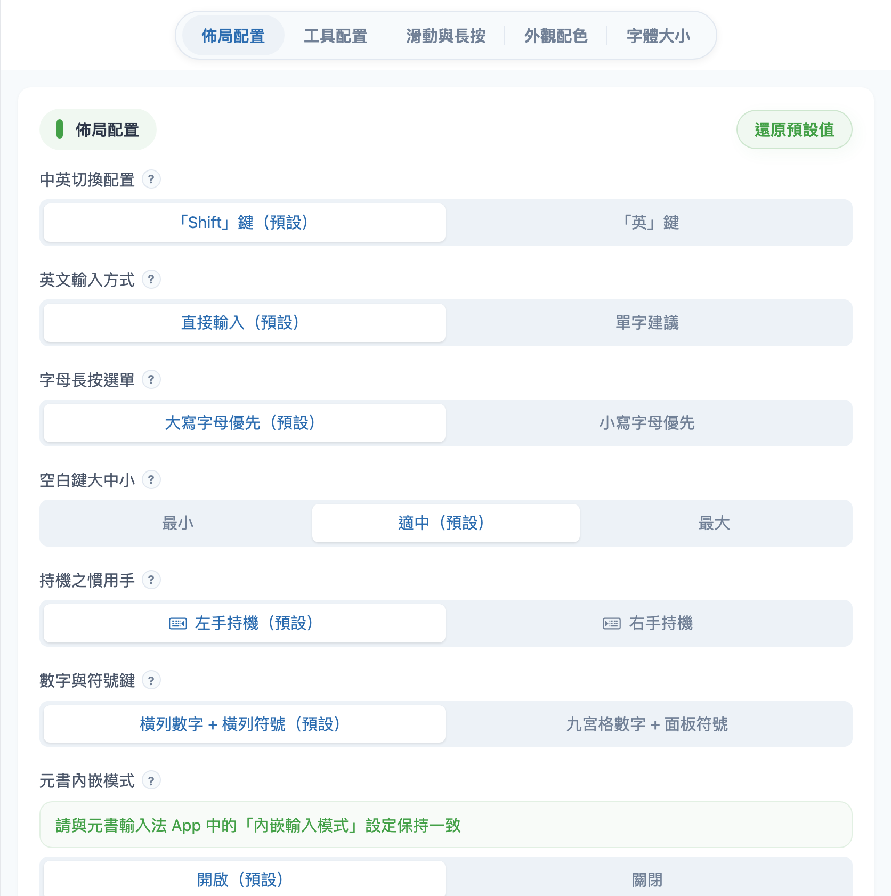

# 設定區頁籤

| 頁籤 | 說明 | 詳見 |
|------|------|------|
| **佈局配置** | 鍵盤怎麼排、怎麼切換中英文 | [佈局配置](settings/layout.md) |
| **工具配置** | 鍵盤上方 10 格工具列要放哪些按鈕 | [工具配置](settings/toolbar-config.md) |
| **滑動與長按** | 上滑、下滑、長按功能開關 | [滑動與長按](settings/swipe.md) |
| **外觀配色** | AI 或手動調顏色 | [外觀配色](settings/appearance.md) |
| **字體大小** | 調整各處文字大小 | [字體大小](settings/font-size.md) |
