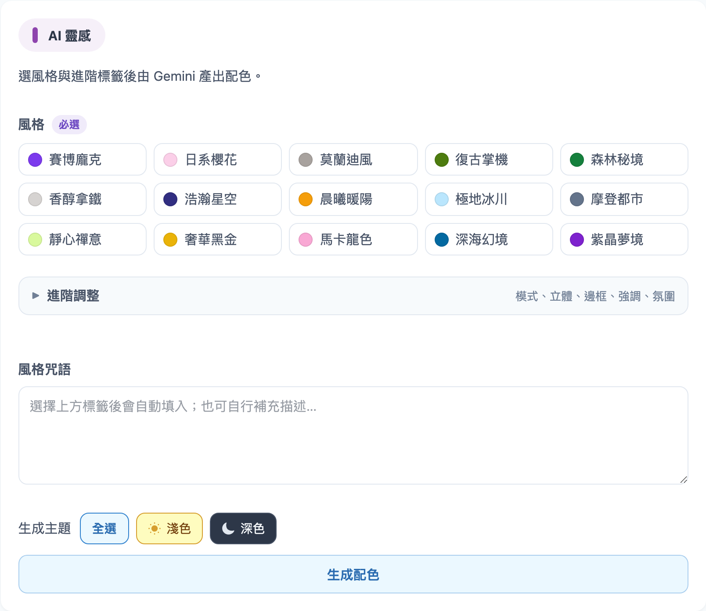
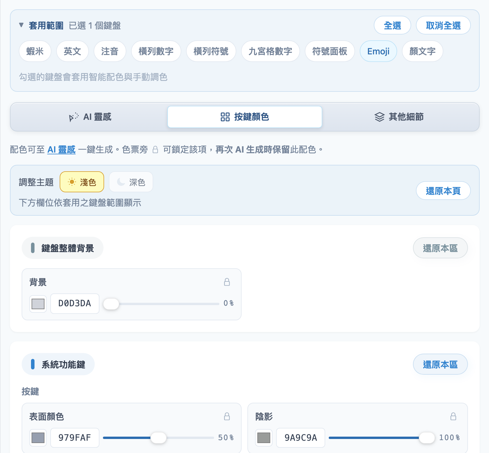
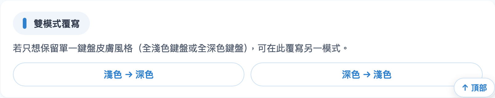

# 外觀配色

分成三個小分頁：**AI 靈感**、**按鍵顏色**、**其他細節**。進入後請先看 [套用範圍](apply-scope.md)。

## AI 靈感（推薦新手）

1. 用 **生成主題** 選淺色、深色，或 **全選**
2. 選一個**風格**（例如日系櫻花、賽博龐克）
3. 可選填「進階調整」與風格描述
4. 按 **「生成配色」**
5. 不滿意可再生成，並搭配「再次生成配色範圍」

| 操作 | 意思 |
|------|------|
| **全選** | 淺色、深色一起生成 |
| **只點淺色或深色** | 只改那一邊；已選的主題再點**不會取消** |

> **生成主題**（AI）與 **調整主題**（手動）及左邊預覽淺／深是**分開**的。

## 再次生成配色範圍

第一次生成後才會出現。可指定只重做哪些區塊（按鍵、氣泡、候選字…）。

| 元素 | 意思 |
|------|------|
| **藍色標籤** | 本次 AI **會**調整 |
| **灰色標籤** | **保留**目前顏色 |
| **右側 ▼** | 展開細項（如氣泡背景、選中文字…） |

與色票旁 **🔒** 鎖定互通。

## 按鍵顏色／其他細節

頂部 **調整主題**（淺色／深色單選）決定右邊編輯哪一套；與左邊預覽互不影響。

| 套用範圍只勾 | 下方常見項目 |
|-------------|-------------|
| **蝦米** | 字母鍵、空白鍵、Enter… |
| **Emoji** | 系統功能鍵、面板背景… |

## 雙模式覆寫

頁面底部可將淺色配色複製到深色，或反向複製。

