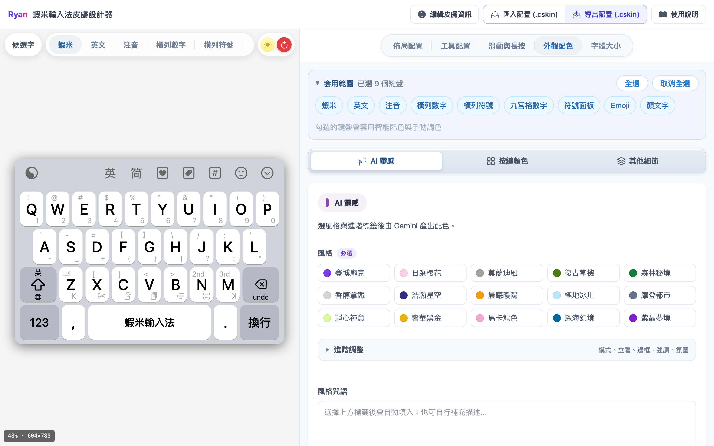
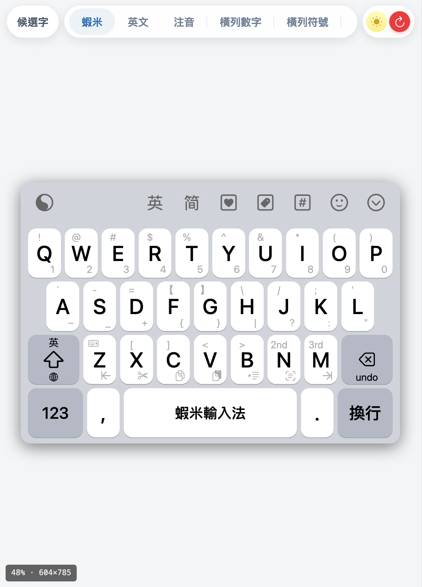
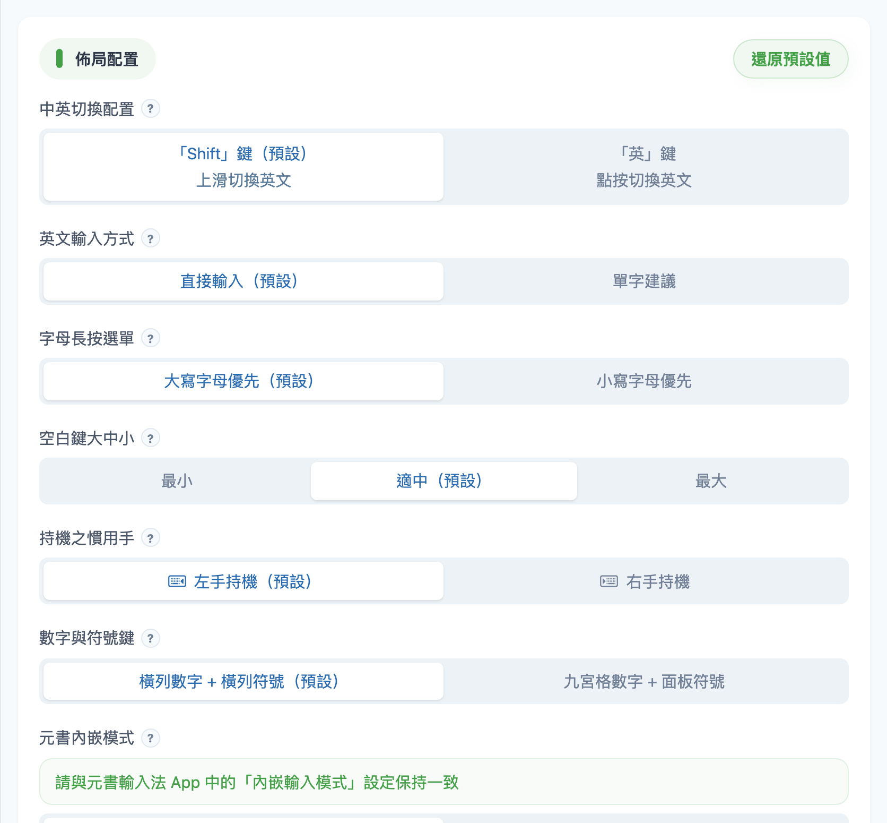
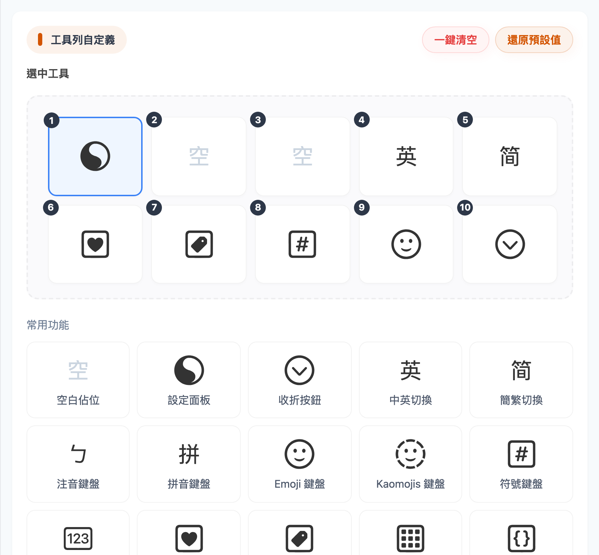
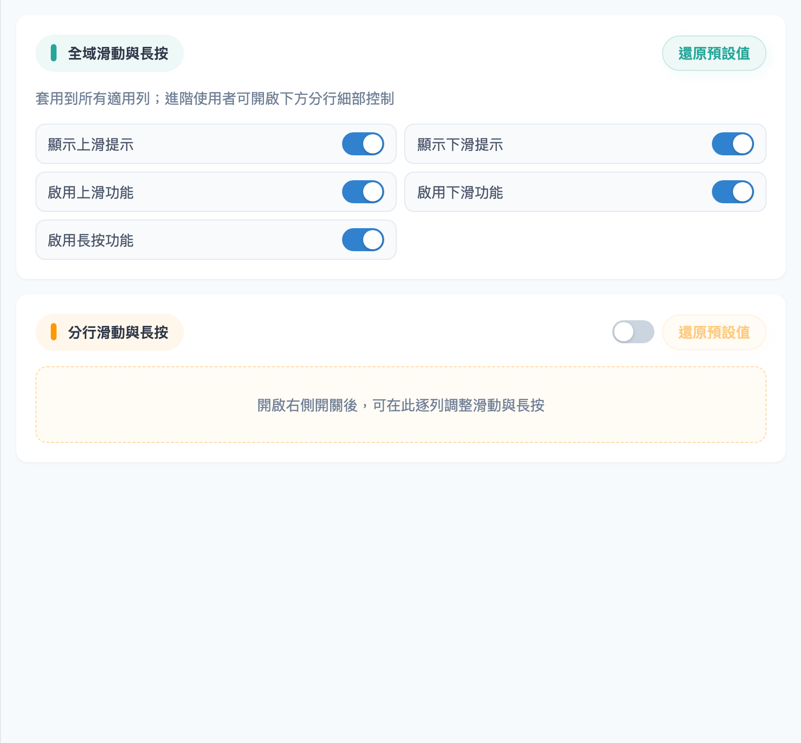
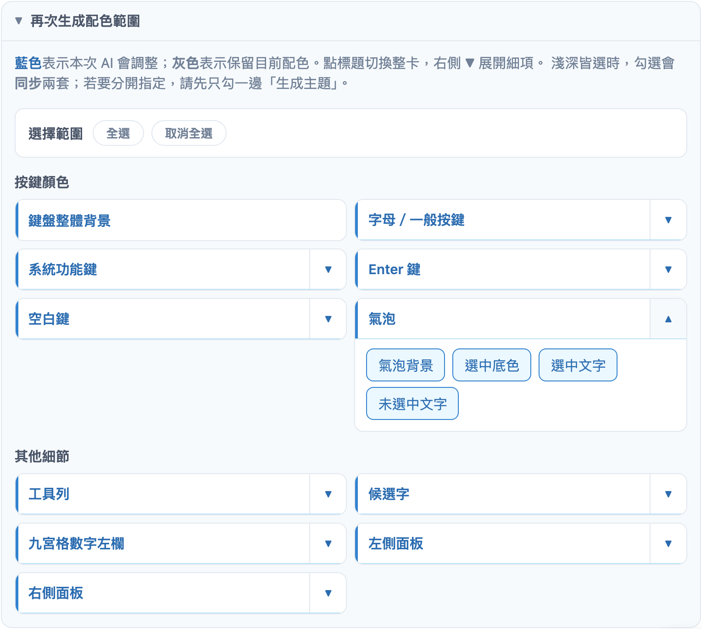
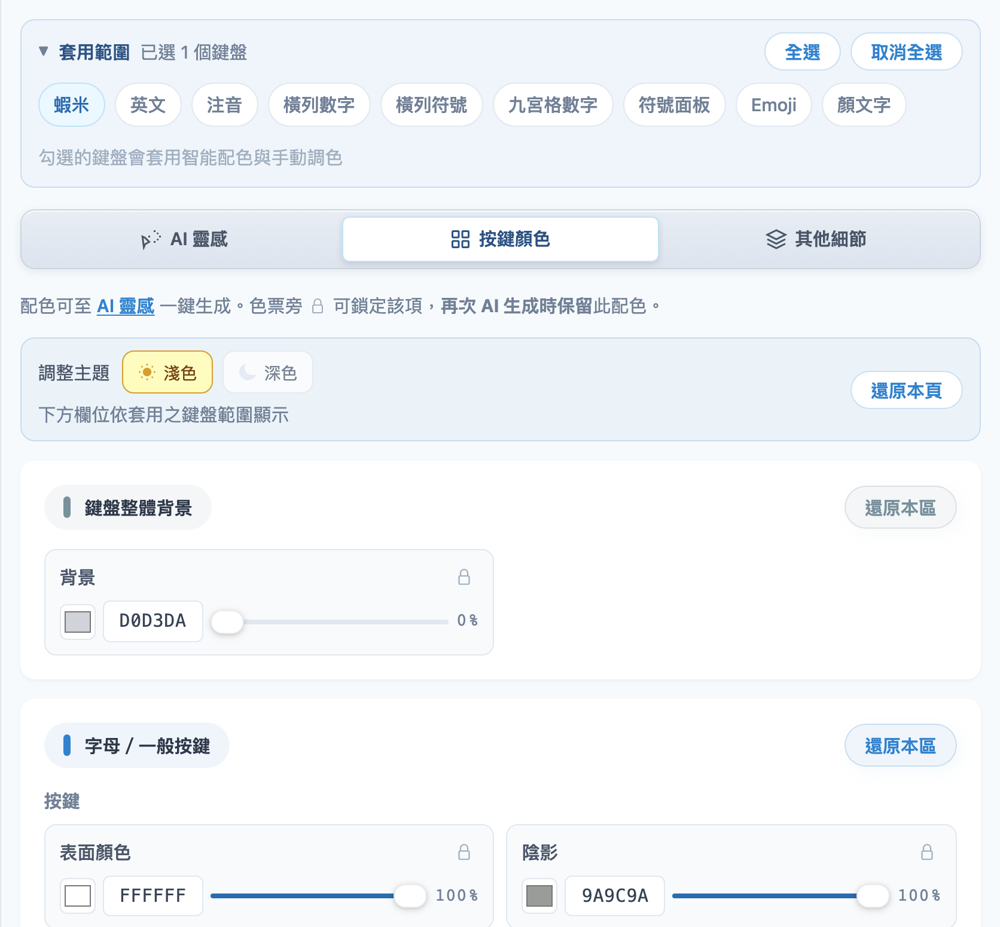
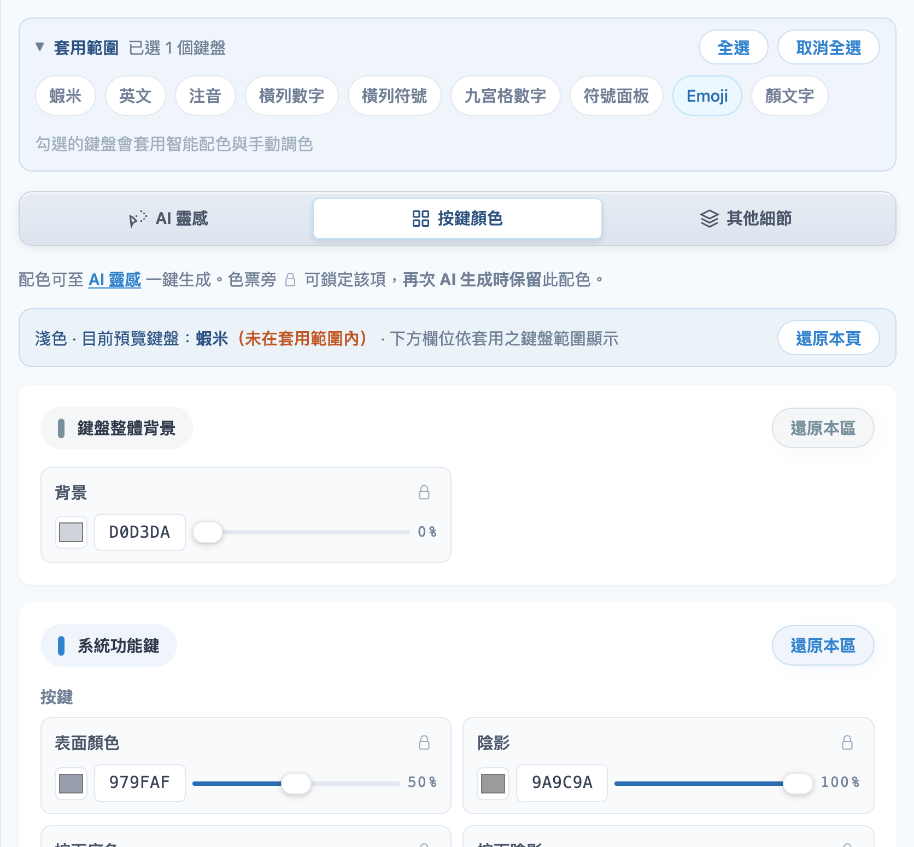
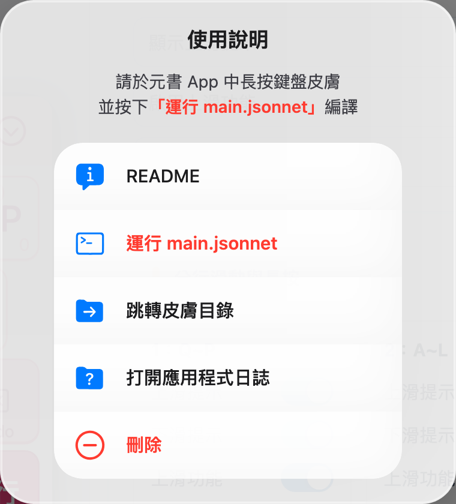

<h1 id="使用說明">蝦米輸入法皮膚設計器 — 使用說明</h1>

## 這是什麼？

這是一個網頁工具，用來設計蝦米輸入法的鍵盤皮膚。

**皮膚設計器網址：** [https://ggininder.work/r/Ryan](https://ggininder.work/r/Ryan)

你可以調整鍵盤長相、顏色、字體大小，設好之後導出 `.cskin` 檔，再放到元書輸入法 App 裡使用。

---

<h2 id="建議操作流程">建議操作流程</h2>

1. **先設皮膚名稱與作者**（右上角「編輯皮膚資訊」）
2. **若要調顏色或字體，先到「外觀配色」或「字體大小」設定「套用範圍」**（要改哪些鍵盤）
3. **在左邊預覽區**切換鍵盤、淺色／深色，邊看效果邊調整
4. **在右邊設定區**調整佈局、工具、顏色、字體
5. **滿意後按「導出配置」**，下載 `.cskin` 檔
6. **到元書輸入法 App** 匯入皮膚，並執行「運行 main.jsonnet」讓皮膚生效

> 導出成功後，畫面會提示你在元書裡要做什麼。也可以隨時按右上角「使用說明」再看一次。

<h3 id="調整顏色時建議這樣做">調整顏色時，建議這樣做</h3>

1. 打開 **外觀配色**
2. **先展開「套用範圍」，勾選要改的鍵盤**（可只勾一個，也可全選）
3. 用 **AI 靈感** 生成，或到 **按鍵顏色／其他細節** 手動微調
4. 左邊預覽可切換不同鍵盤看效果（與套用範圍無關，只是預覽用）
5. 不滿意再 **再次生成**，並用「再次生成配色範圍」指定只改哪些項目

---

<h2 id="套用範圍">套用範圍（調顏色前先看這裡）</h2>

「套用範圍」在 **外觀配色**、**字體大小** 兩個頁籤的**最上方**。

它決定：你接下來改的顏色（或字體），要套用到**哪些鍵盤**，以及**下方會出現哪些可調項目**。

| 操作 | 意思 |
|------|------|
| **全選** | 9 個鍵盤一起套用 |
| **只勾幾個** | 只有勾選的鍵盤會變色；沒勾的維持原樣 |
| **取消全選** | 等於暫時不對任何鍵盤套用（手動改色時請至少勾一個） |

**為什麼要先選？**

- 若只想改「蝦米」，請先**只勾蝦米**，避免其他鍵盤被一起改掉。
- **下方能調的顏色項目，是依「套用範圍」顯示的**，不是依左邊預覽目前切到哪個鍵盤。  
  例如：套用範圍只勾 **Emoji**，就算左邊預覽還在看蝦米，右邊也只會出現 Emoji 相關的選項。

> **佈局配置、工具配置、滑動與長按** 仍會套用到全部鍵盤，沒有「套用範圍」選項。

---

<h2 id="畫面介紹">畫面介紹</h2>

<h3 id="上方工具列">上方工具列</h3>

| 按鈕 | 用途 |
|------|------|
| 編輯皮膚資訊 | 設定皮膚名稱、作者（會寫進導出的檔案） |
| 匯入配置 | 讀取 `.cskin` 繼續編輯（自己的或別人的皮膚皆可） |
| 導出配置 | 下載 `.cskin` 皮膚檔 |
| 使用說明 | 查看如何在元書輸入法 App 裡讓皮膚生效 |

<h3 id="左邊鍵盤預覽">左邊：鍵盤預覽</h3>

- **鍵盤分頁**：可切換蝦米、英文、注音、數字、符號、Emoji、顏文字等 9 種鍵盤（**僅供預覽**）
- **候選字**：可預覽候選列的收合／展開效果（部分鍵盤不適用，按鈕會變灰）
- **太陽／月亮**：切換淺色或深色預覽
- **紅色重置**：把所有設定恢復成剛打開時的狀態（會先問你是否確定）

<h3 id="右邊設定區">右邊：設定區</h3>

有五個頁籤：

1. **佈局配置** — 鍵盤怎麼排、怎麼切換中英文
2. **工具配置** — 鍵盤上方工具列要放哪些按鈕
3. **滑動與長按** — 上滑、下滑、長按功能開關
4. **外觀配色** — 用 AI 或手動調顏色
5. **字體大小** — 調整各處文字大小

---

<h2 id="各頁籤怎麼用">各頁籤怎麼用</h2>

<h3 id="佈局配置">1. 佈局配置</h3>

設定鍵盤的基本行為，例如：

- 用 **Shift** 還是 **英** 鍵切換中英文
- 英文是直接輸入，還是顯示單字建議
- 空白鍵大小、慣用手（左手／右手持機）
- 數字鍵盤用橫列還是九宮格
- 是否開啟內嵌輸入模式（請與元書輸入法 App 裡的設定一致）

每一項標題旁邊有 **?** 按鈕，點一下可展開說明，幫助你選對選項。

每個區塊右上角都有「還原預設值」，只還原那一區。

<h3 id="工具配置">2. 工具配置</h3>

鍵盤最上方有 10 個工具格，可以：

- 點選某一格，再選要放什麼工具（例如符號、Emoji、設定等），點擊下方工具，可依序填入上面的「選中工具」
- 用「清空全部」或「還原預設」快速重置

<h3 id="滑動與長按">3. 滑動與長按</h3>

控制鍵盤的上滑、下滑、長按功能：

- 上方有**總開關**，可先全部開或關
- 下方**分行滑動與長按開關**可針對每一行（Q 列、A 列等）個別設定

這些設定會套用到**全部鍵盤**，不需要另外勾選。

<h3 id="外觀配色">4. 外觀配色</h3>

這一頁分成三個小分頁：**AI 靈感**、**按鍵顏色**、**其他細節**。  
進入後請先看上方的 **套用範圍**（上一節說明）。

#### (1) AI 靈感（推薦新手先用）

1. 選一個**風格**（例如日系櫻花、賽博龐克）
2. 可選填「進階調整」與風格描述
3. 按 **「生成配色」**，會配一套淺色＋深色
4. 不滿意可以**再按「生成配色」**；此時可搭配下方的「再次生成配色範圍」（見下一小節）

#### (2) 再次生成配色範圍（第二次以後才會用到）

**第一次**按「生成配色」前，不會出現這一區。  
**已經生成過至少一次**之後，若只想改一部分（例如只改氣泡、不動按鍵），再展開 **「再次生成配色範圍」**。

**怎麼讀這個畫面？**

| 元素 | 意思 |
|------|------|
| **調整主題：淺色／深色** | 這次再生成要改淺色、深色，或兩邊都改（至少保留一個） |
| **藍色標籤** | 本次 AI **會**調整 |
| **灰色標籤** | 本次 **保留**目前顏色，不動 |
| **全選／取消全選** | 一次全部勾上或全部取消 |
| **右側 ▼** | 展開更細的單項（例如「氣泡」→ 氣泡背景、選中底色、選中文字…） |

**建議操作步驟**

1. 在 **AI 靈感** 選好風格（可改描述文字）
2. 展開 **再次生成配色範圍**
3. 用 **調整主題** 決定只改淺色或深色
4. **點標題或細項標籤**，把不想動的區塊取消（變灰 = 保留）
5. 需要更細時，點卡片右側 **▼** 展開（如圖中的「氣泡」）
6. 再按 **「生成配色」**

**和 🔒 鎖定的關係**

- 在「按鍵顏色」「其他細節」按 🔒 鎖住的項目，這裡會變成**灰色（不調整）**
- 在這裡取消勾選，也等同鎖住；兩邊是**同步**的

#### (3) 按鍵顏色／其他細節

手動調整各區塊的顏色。  
狀態列會顯示：**淺色或深色 · 目前預覽鍵盤：○○**，並註明「下方欄位依套用之鍵盤範圍顯示」。

**重點：套用範圍勾了哪些鍵盤，下方可調的項目就不同**（與左邊預覽切到哪個鍵盤無關）。

對照範例（都在 **按鍵顏色** 分頁）：

| 套用範圍只勾 | 下方常見項目 |
|-------------|-------------|
| **蝦米** | 鍵盤整體背景、**字母／一般按鍵**、空白鍵、Enter 鍵… |
| **Emoji** | 鍵盤整體背景、**系統功能鍵**…（面板類鍵盤，沒有字母鍵區） |

色票旁邊的 **🔒** 可鎖住該顏色，之後 AI 再生成時會保留。

#### (4) 雙模式覆寫（AI靈感、按鍵顏色及其他細節頁面的底部）

若你只想做「全淺色」或「全深色」皮膚，可以把一邊的配色複製到另一邊。

<h3 id="字體大小">5. 字體大小</h3>

調整字母、功能鍵、空白鍵、工具列等文字大小。  
同樣要先看 **套用範圍**；勾了哪些鍵盤，就只顯示相關項目。  
淺色與深色共用同一組字體大小。

---

<h2 id="匯入與導出">匯入與導出</h2>

### (1) 導出

按「導出配置」→ 下載 `.cskin` 檔 → 依畫面提示到元書輸入法 App 操作：

1. 長按鍵盤皮膚
2. 按 **「運行 main.jsonnet」**（最重要這一步）
3. 之後可依需要查看 README、跳轉皮膚目錄等

> 導出成功時也會出現相同提示。右上角「使用說明」隨時可再打開。

### (2) 匯入

按「匯入配置」選 `.cskin` 檔即可。

**可以匯入：**

- **你自己**之前導出的皮膚，接續上次的工作
- **別人分享**給你的皮膚，在設計器裡查看或微調後再導出

**匯入後會保留的內容包括：**

- 佈局、工具、滑動等設定
- 顏色與字體
- **AI 靈感**裡已選的風格、進階標籤與描述文字（方便接著再生成）

> **注意：** 非常舊版的 `.cskin` 可能無法匯入，請用新版設計器重新導出。

### (3) 元書 App 裡的實際操作

「運行 main.jsonnet」要在**手機上的元書輸入法 App**裡操作（長按皮膚後從選單點選）。  

---

<h2 id="常見問題">常見問題</h2>

**Q：改了顏色，為什麼只有部分鍵盤有變？**  
A：到「外觀配色」頂部看「套用範圍」，確認要改的鍵盤都有勾選。

**Q：為什麼右邊找不到某個顏色選項？**  
A：看「套用範圍」勾了哪些鍵盤。蝦米、Emoji、九宮格等，能調的項目本來就不一樣；與左邊預覽目前看哪個鍵盤無關。

**Q：左邊預覽寫「未在套用範圍內」是什麼意思？**  
A：左邊只是預覽畫面，套用範圍沒勾到那個鍵盤時會出現這行提示；改色仍以套用範圍為準。

**Q：AI 生成後，某個顏色被改掉了？**  
A：生成前用 🔒 鎖住，或在「再次生成配色範圍」把該項取消（變灰保留）。

**Q：按了重置，全部不見了？**  
A：左邊預覽區的紅色重置會還原**所有**設定。若只想還原某一區，用該區的「還原預設值」。

**Q：導出後在手機上沒變化？**  
A：請確認已在元書裡執行「運行 main.jsonnet」。

**Q：內嵌模式要開還是關？**  
A：請與元書輸入法 App「內嵌輸入模式」設定保持一致。

---

<h1 id="新版更新了什麼">新版更新了什麼？</h1>

如果你用過舊版皮膚設計器，以下是**真正有變**的地方：

## 頁籤重新整理

| 舊版 | 新版 |
|------|------|
| 按鍵佈局（含滑動設定） | **佈局配置** + 獨立的 **滑動與長按** |
| 基礎外觀（顏色與字體混在一起） | **外觀配色** + **字體大小** 分開 |
| 進階微調（每個鍵盤各自開關覆蓋） | **套用範圍**（直接勾選要套用的鍵盤） |

**「進階微調」拿掉了** — 以前要一個一個鍵盤開關「是否覆蓋基礎外觀」，現在在「套用範圍」勾選就好。

## 新增 AI 靈感配色

舊版要手動一項項調色；新版可用 **AI 靈感** 一鍵生成淺色＋深色，再手動微調。

## 新增「再次生成配色範圍」

生成過一次之後，可以指定只重做哪些區塊（按鍵、氣泡、候選字…），並選只改淺色或深色。  
與色票旁的 **🔒** 鎖定互通。

## 氣泡 PNG 可跟著配色調色

新版匯出時，會依你設定的氣泡顏色**自動重畫** `hint.png`（點按／長按氣泡圖），不必再用圖片軟體手改。  
在「按鍵顏色」的 **氣泡** 區，或「再次生成配色範圍」裡的氣泡細項都可調整。

## 手機版面優化

窄螢幕（手機）上，預覽區與設定區改為**上下各半**，比舊版更容易同時看到鍵盤與設定。

## 匯入格式

新版 `.cskin` 與舊版不完全相容。  
**舊版匯出的檔案可能無法匯入新版**；若匯入失敗，請用新版重新設計並導出。

---
